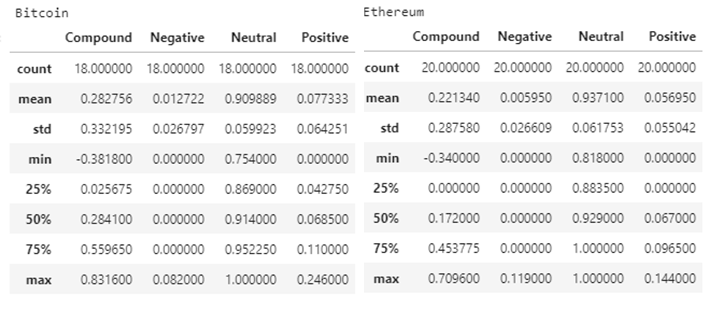

# NLP-Homework12
NLP - Homework 12 - Resubmitted

## Summary

In this homework we use natural language processing to analyze news on Bitcoin and Ethereum. We first run a Vader Sentiment to determine whether a news article can be interpreted as positive, neutral or negative. Second, we apply NLP techniques to clean the text of the articles and extract the most used words. Finally, we build on the prior analysis, by extracting named entities using Spacey from the articles. 

### 1. Vader Sentiment 

Vader Sentiment allows us to determine the sentiment of the article's content. The below table summarizes the sentiment analysis for BTC and ETH.

Q: Which coin had the highest mean positive score?

* A: Bitcoin has the highest mean positive score with a mean of 0.0733 vs 0.057 for Ethereum

Q: Which coin had the highest compound score?

* A: Bitcoin has the highest mean compound score with a mean of 0.2828 vs 0.2213 for Ethereum. When speaking about an individual articles, the max score was for a Bitcoin article with 0.8316 vs 0.7096 for Ethereum.

Q. Which coin had the highest positive score?

* A: The highest positive score is for a Bitcoin article with 0.246. The max for an Ethereum article was 0.144

### 2. NLP

We use NLTK, to graphically deploy the most repeated words. We did other analysis, such as calculating the most pair of repeated words. Charts below. 

**Bitcoin World Cloud**

  

**Ethereum World Cloud**

   

### 2. Space and Entities Analysis

lastly we used Spacey to extract and visually highlight entities mentioned in the articles. The entities can be people, organizations, dates, time, money amounts, among others. Below, a snapshot of how the text is presented graphically after using Spacey for Bitcoin and Ethereum. 

**Bitcoin Spacey Entities**

**Ethereum Spacey Entities**

